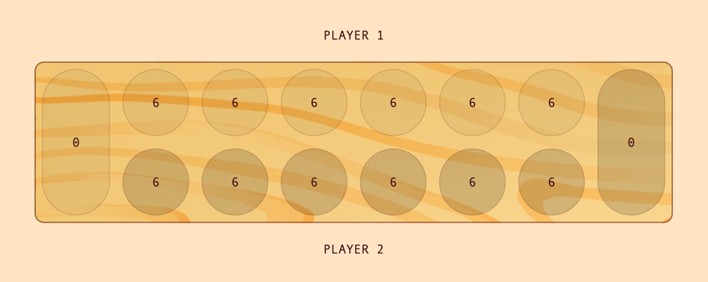

# Kalaha game

This application is built on top of the Spring Boot framework and written in Kotlin. It provides a REST API to manage the game Kalaha (more info about the game on [Wikipedia](https://en.wikipedia.org/wiki/Kalah)).

Spring Boot takes away a lot of boilerplate code, making it easier to build production-grade applications while focusing on the business logic. The game dynamic is implemented by using the State pattern and the Data Transfer Objects containing the game context and used by the main controller are automatically generated based on the [API contract](docs/swagger.yaml) via OpenAPI Generator Maven plugin.

**API Documentation:** https://app.swaggerhub.com/apis/raffa134/KalahaAPI/1.0.0

The project also includes a simple UI (HTML + CSS + plain JavaScript) that allows 2 users to play the game (more info [here](#try-the-application)):



### Prerequisites to run the application

Before being able to run this project please make sure you have the following packages installed:
- Git
- Java
- Maven

Alternatively you can run the application as a [docker container](#docker-container).

### Build and execute the project

#### Executable .jar file
In order to build the project and run the service, you need to execute the following commands from the project's **root folder**:

```bash
mvn clean install
mvn spring-boot:run -Dspring-boot.run.profiles=local
```

#### Docker Container
The application is also runnable as a Docker container.
Run the following commands from the project's **root folder** in order to build the docker image and run it locally:

```bash
mvn clean install
docker build -t kalaha-game -f docker/Dockerfile .
docker run -p 8080:8080 kalaha-game
```

In case you don't have maven installed, you can directly pull the image from my docker hub repository:
```bash
docker run -p 8080:8080 raffa134/kalaha-game:1.0.0
```

### Try the application

You can try the application via the web app present in the [kalaha-ui](kalaha-ui) folder.

Follow below instructions to play the game:
1. Run the back-end service (see [build and execute the project](#build-and-execute-the-project))
2. Open the `index.html` file in your browser (web app is optimized for Google Chrome)
3. Click on "Start new game"
4. Have fun! :)